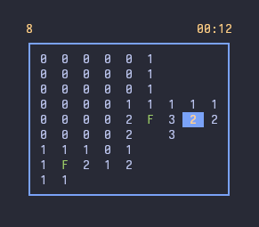

# minesweeper
TUI minesweeper written in C++.  

## Dependencies
- ncurses
- [p-ranav/argparse](https://github.com/p-ranav/argparse)

## Usage
```
$ ./minesweeper -h
Usage: minesweeper [--help] [--version] [--rows ROWS] [--cols COLS]
                   [--mines MINES] [--difficulty D]

Play minesweeper

Optional arguments:
  -h, --help          shows help message and exits 
  -v, --version       prints version information and exits 
  -r, --rows ROWS     board height [default: 9]
  -c, --cols COLS     set board width [default: 9]
  -m, --mines MINES   set mine count [default: 10]
  -d, --difficulty D  set difficulty level (1-3), overrides other options [default: 1]

Controls:
  Arrow keys / WASD   move the cursor
  Space               reveal a cell
  F                   flag a cell
  Q                   quit
```

To disable colours compile with `NO_COLORS`.  

## Showcase

